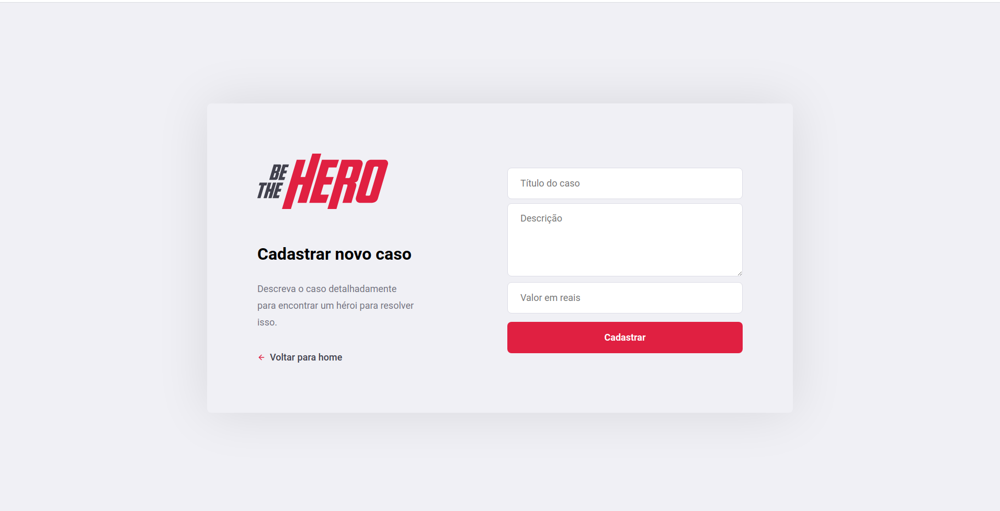

<h1 align="center">
  
</h1>

<h5 align="center">
  O Be The Hero é um projeto realizado durante a Semana Omnistack 11
</h5>

## Mobile
<h1 align="center">
  
  
</h1>

## Web
<h1 align="center">
  
  
  
  
</h1>

## Autor

Wanderlei Santos

- [linkedin.com/in/wanderleidossantos](https://www.linkedin.com/in/wanderleidossantos/)

## Licença

Este projeto está licenciado sob a licença MIT - consulte o arquivo [LICENSE](LICENSE) para obter detalhes.
